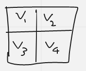

# Idea for a Piet to x86_64 compiler

Maintain the following registers: 

* `rax`: direction pointer state ({0 ... 4} for right, down, left, up).
* `rbx`: codel chooser state ({0, 1} for left, right)
* `rcx`: address of current color block (label address should be known at compile-time)
* `r8`: color of previous color block
* `r9`: color of current color block
* `r10`: number of codels in a color block.
* `r11`: Piet stack depth (so we can add back the correct offset to align the stack after upon termination, if termination occurs).
* `r12`: retries counter (if we hit 8, then terminate the program)
* `r13`: old label address (we need this to determine whether or not to increment the retries counter)

Everything else can be just pushed / popped from the stack, though I suspect handling edge cases such as there not being enough operands on the stack will be pretty annoying.

Notes:

* The color of each block (discarding white and black) can be represented by some value in Zmod(18), so that their differences, which encode the command to be executed, are also in that range.  
* We can compile an auxiliary function that decodes the command based on `r9 - r8` and chooses which command to call.

# Execution

Like other languages, we can model Piet control flow like a directed graph: each vertex represents a color block and each edge represents a transition between color blocks, which encodes the command to be executed.  At compile-time we can partition our image into their component blocks, each of which has at most 4 adjacencies.  To determine the adjacencies of a color block, we can perform a flood-fill / depth-first search within the color block, and find the boundaries via casework on the direction pointer / codel chooser states.

We can then randomly generate a label name for each vertex and store it, along with the vertex's color in a record like so:

```haskell
data CBVertex = Vertex {
    name :: String,
    color :: Int,
    boundaries :: [Position],
    adjacencies :: [Vertex]
}
```

As an example, consider a small square Piet program with only 4 color blocks corresponding to vertices `v_1 ... v_4`, like so:



So 

* `v_1` is bordered by `v_2` and `v_3` 
* `v_2` is bordered by `v_1` and `v_4`
* `v_3` is bordered by `v_1` and `v_4`
* `v_4` is bordered by `v_2` and `v_3`.  

Thus, we can assign some label name to each `v_i`, and output code to jump to a certain adjacency of v_i depending on the values of dp / cc, or back to itself if none of the values are valid.  For example, for `v_2`, we could output the following asm: 

```
label_v2:
  sub rdx, r9, r8
  mov r12, 0
  cmp rbx, 0
  je label_v2_dp
  cmp rbx, 1
  je label_v2_dp

label_v2_invalid:
  call increment_retries_counter
  jmp label_v2

label_v2_dp:
  cmp rax, 1
  jmp label_v2
  cmp rax, 2
  jmp label_v4
```

